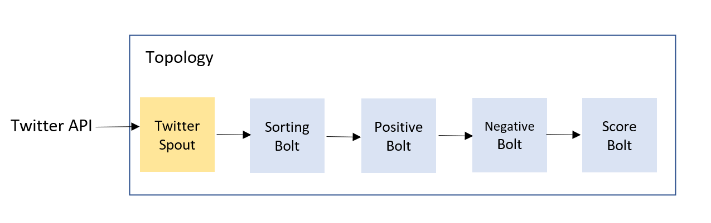

# Twitter COVID Vaccine Sentiment Analysis :mask::syringe:
This project analyses tweets related to COVID19 vaccine using ApacheStorm framework and twitter API.

## 1. Getting Started


In order to run the project on your local machine follow these instructions

### Get a copy

Get a copy of this project by simply running the git clone command.

``` git
$ git clone https://github.com/mfijalkowska/COVID-Vaccine-Sentiment-Analysis
```

### Prerequisities

Before running the project get Twitter API keys from: https://developer.twitter.com/en/docs/twitter-api/getting-started/guide and replace them in twitter4j.properties file.

### Installation
Storm setup:
#### 1. Download
``` git
apache-storm-0.9.3
```
from https://archive.apache.org/dist/storm/apache-storm-0.9.3/
#### 2. Move to a new Storm directory and unpack
``` git
$ sudo mv apache-storm-0.9.3 /usr/local/storm
$ tar -xzf apache-storm-0.9.3.tar.gz 
```
#### 3. Add Storm to the PATH
``` git
export PATH=$PATH:/usr/local/storm/bin
```
##  2. System Structure &#38; Design
The project is deployed in local mode which simulates Storm Cluster three main components:
 1. Nimbus – runs the topology on a master node, distributes the code across the cluster, monitors computations &#38; failures and relocates workers if needed.

 2. Zookeeper – coordinates the cluster and maintains the shared data with synchronizations techiniques making it very robust. Nimbus depends on zookeeper to monitor working node status.
 
 3. Supervisor – daemin run by a worker node. Listens for
work assigned to its machine, starts & stops worker processes if necessary (based on what Nimbus has assigned
to it). 

### Data Stream Model
The topology is kept simple and each bolt is set with parallelism of 1 thread.



Pipeline consists of:
1. TwitterSpout - reads the tweets from Twitter
API, converts them into tuple format and emits to SortingBolt.

2. SortingBolt - processes tweet, i.e., filters out all irrelevant words, checks for COVID-related hashtags and keeps a count for the number of tweets.

3. PositiveBolt - counts the number of positive words
occurences. Saves the score in an array that is emitted together with the tweet text and numOfTweets to
NegativeBolt.

4. NegativeBolt - similarly to PositiveBolt, here the
number of negative words is counted and stored in the
array.

5. ScoreBolt - final bolt that determines whether the
tweet is positive, negative or neutral. It also counts how
many tweets were found in total, outputs current tweet
and calculated sentiment (1=positive, -1=negative, otherwise neutral=0).
